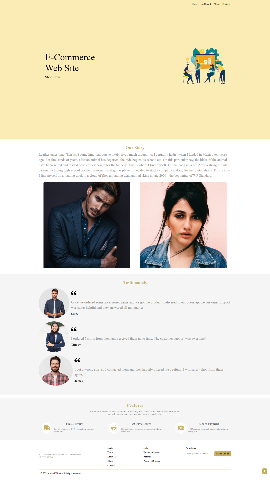

# E-Commerce website

## About
This is a small prototype for an e-commerce website front-end. It was a final project for JS course in Information Technology Instetute (ITI).

### This website contains

- [x] Home page: which contains discounts and offers section, and the main section of project (Shop section).

- [x] Dashboard page: which contains the cart section inclouds the products that the client added from the shop.

- [x] Contact page: which contains form with full validation using native JS.

- [x] About page.

## Technologies used 

- HTML5
- SASS
- CSS3
- Javascript

## Project structure

- BL folder: It's presents the business layer, in this folder you can explore the entities that built as a classes inclouds it's properties and fuctions.
- DAL folder: It's presents the data access layer which is a JSON filein this case is .
- IL folder: It's presents the interface layer which inclouds HTML, SASS, CSS, and javascript files. The javascript files in IL is handel front-end business like sliders, animations, form validation, ..... .
